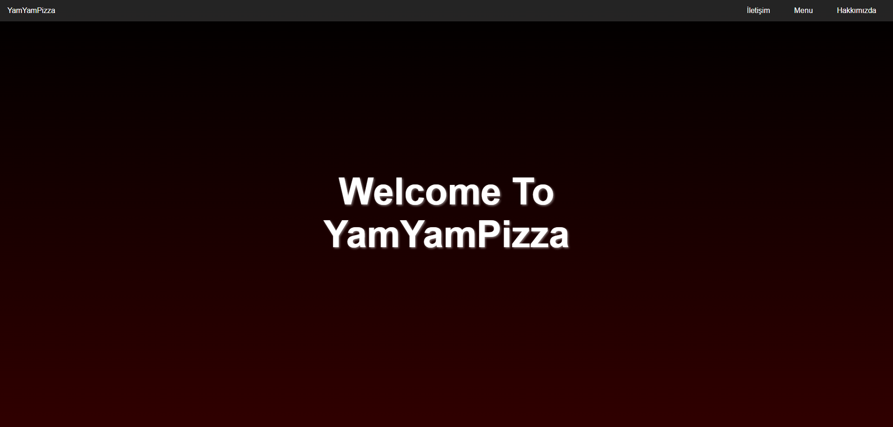
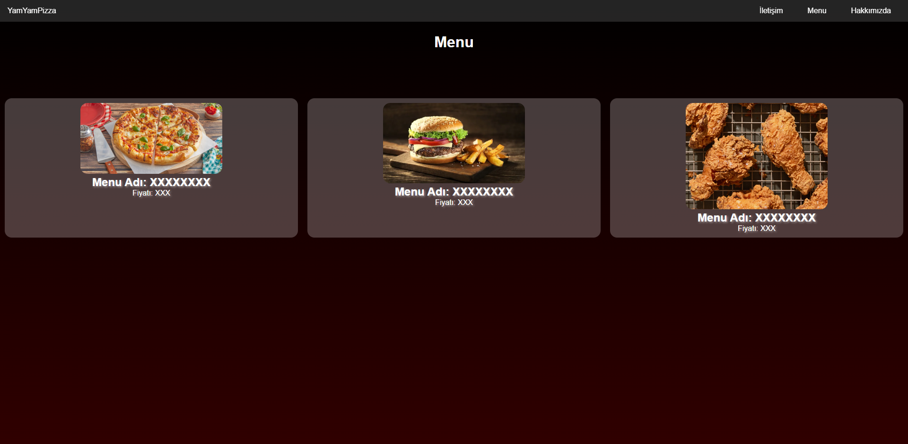
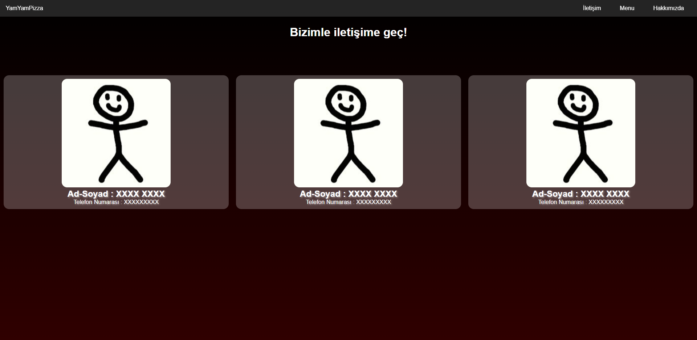

# 🍽️ Restaurant App With Modules

**Restaurant App With Modules** is a simple and modular restaurant website built using vanilla JavaScript, HTML, and CSS. It features a multi-page layout (Home, Menu, Contact) managed dynamically through JavaScript modules. 

---

## 🎯 Purpose

- Build a basic restaurant website using modular JavaScript
- Practice DOM manipulation and page routing with vanilla JS
- Create a clean and responsive UI using HTML and CSS

---

## 🚀 Features

- 🏠 **Home Page**: Introduction to the restaurant
- 📋 **Menu Page**: Displays sample dishes
- 📞 **Contact Page**: Shows contact information
- 🧩 **Modular Structure**: Uses JavaScript modules to manage content dynamically

---

## 🛠️ Tech Stack

| Layer         | Technologies         |
|---------------|----------------------|
| Frontend      | HTML, CSS, JavaScript (ES Modules) |
| Tools         | Git, GitHub, VS Code |

---







---
## 📦 Getting Started

Clone the repository and open the `index.html` file in your browser:

```bash
git clone https://github.com/kuyucucaner/Restaurant-App-With-Modules.git
cd Restaurant-App-With-Modules
